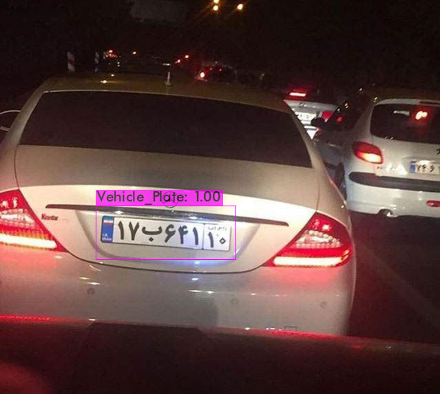
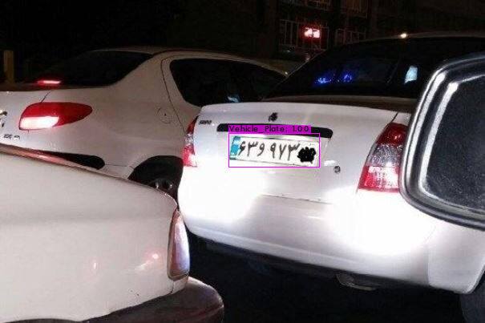
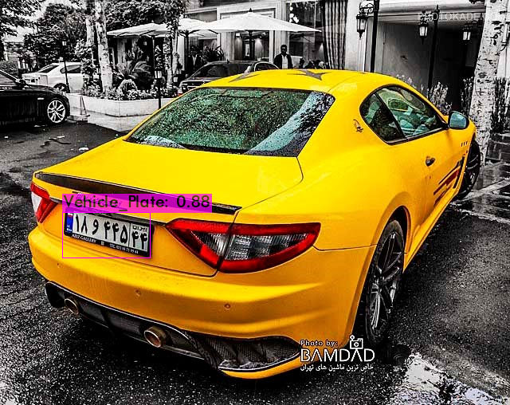
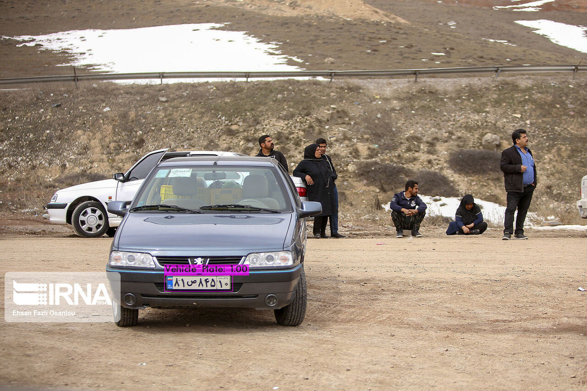
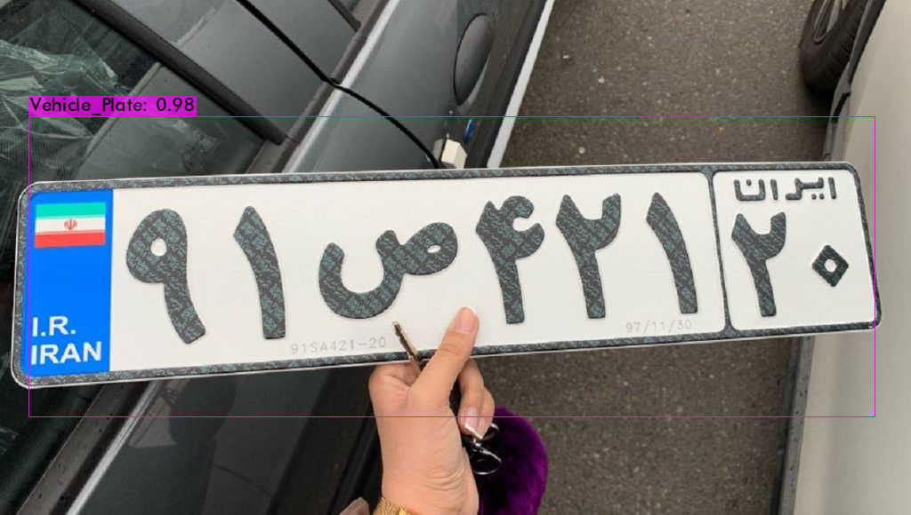

## Iranian vehicle plate database training with yolov3
### clone this repo and download dataset
git clone https://github.com/SeyedHamidreza/car_plate_dataset.git  
Using LabelImg software to select vehicle plate in all images of dataset and annotate the dataset to create a custom Object Detection Model.

### clone this repo and download Darknet
git clone https://github.com/AlexeyAB/darknet.git  
cd darknet/  
wget https://pjreddie.com/media/files/yolov3.weights

### Clone this repo and generate train.txt
git clone https://github.com/theAIGuysCode/YoloGenerateTrainingFile.git

### Train and save weights in backup file
mkdir backup  
./darknet detector train data/vehicle_plate.data cfg/yolov3_custom.cfg darknet53.conv.74  
Get darknet53.conv.74 file from here : wget https://pjreddie.com/media/files/darknet53.conv.74

### Predict and save outputs in results file
mkdir results  
./darknet detector test data/vehicle_plate.data cfg/yolov3_custom.cfg backup/yolov3_custom_last.weights data/car1.jpg

### Results

